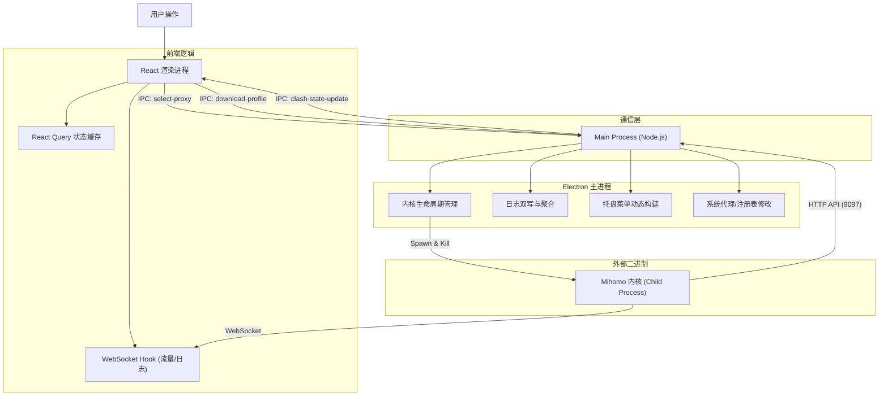

# Clash Flux

   

**Clash Flux** 是一个基于 Electron + React 构建的现代化的、轻量级的 Mihomo (原 Clash Meta) 内核桌面客户端。

它旨在提供极致的 UI/UX 体验，摒弃繁杂的配置，专注于**可视化监控**、**便捷的代理管理**以及**稳定的系统集成**。

-----

## ✨ 核心特性

### 🖥️ 现代化 UI 交互

  - **Shadcn/ui 设计语言**：极简、高密度、现代化的界面风格。
  - **流畅动画**：页面切换渐入浮动、列表滚动优化、卡片微交互。
  - **暗黑模式**：完美支持亮色/暗色主题切换及跟随系统。

### 🚀 强大的内核控制

  - **Mihomo 内核集成**：作为 Sidecar 附属进程运行，全自动生命周期管理。
  - **多模式支持**：一键切换 Rule (规则)、Global (全局)、Direct (直连) 模式。
  - **系统级集成**：
      - **系统代理**：自动修改系统注册表/网络设置。
      - **TUN 模式**：支持虚拟网卡模式（需管理员权限），接管所有软件流量。
      - **托盘菜单**：支持后台运行，右键托盘可快速切换节点、模式及开关代理。

### 📊 数据可视化与监控

  - **实时仪表盘**：WebSocket 实时连接，毫秒级流量波形图更新。
  - **连接管理 (Connections)**：
      - 实时查看当前活跃连接。
      - **进程识别**：精准显示发起连接的程序图标与名称。
      - 支持一键断开指定连接。
  - **历史统计 (Analytics)**：
      - 基于本地日志的双写存储架构。
      - **24小时流量趋势**：分时段记录流量消耗。
      - **访问排行**：可视化展示 Top 10 域名及协议分布（扇形图/条形图）。

### ⚡️ 代理与订阅管理

  - **代理组管理**：
      - 自动识别 Selector (手动) 与 URLTest (自动) 分组。
      - 支持按**延迟**、**名称**排序。
      - 支持当前分组批量 **延迟测速 (Latency Test)**。
  - **订阅系统**：
      - 支持导入远程 YAML 链接。
      - 自动处理 Base64 编码的订阅内容。
      - 本地文件持久化存储与热重载切换。

-----

## 🛠 技术架构

本项目采用 **Electron 主进程** 与 **React 渲染进程** 分离的架构，并通过 IPC 通道进行安全通信。

### 技术栈

  - **核心框架**: [Electron](https://www.electronjs.org/) + [Vite](https://vitejs.dev/)
  - **前端视图**: [React 18](https://react.dev/) + [TypeScript](https://www.typescriptlang.org/)
  - **UI 组件库**: [Shadcn/ui](https://ui.shadcn.com/) + [TailwindCSS](https://tailwindcss.com/)
  - **状态管理**: [TanStack Query (React Query)](https://tanstack.com/query/latest) (处理服务端状态)
  - **图表库**: [Recharts](https://recharts.org/)
  - **核心内核**: [Mihomo (Clash Meta)](https://github.com/metacubex/mihomo)

### 架构设计图



### 关键技术实现

1.  **IPC 代理切换**：为了解决前端直接请求内核可能遇到的网络环境问题，所有“切换节点”的操作均委托给 Electron 主进程通过 Node.js 原生 Fetch 完成，确保 100% 成功率。
2.  **双向状态同步**：托盘菜单的操作会通过 IPC 通知渲染进程刷新 React Query 缓存；渲染进程的操作也会触发托盘菜单的重建，保证状态一致性。
3.  **日志双写**：主进程通过 WebSocket 监听内核日志，一方面写入本地 `.log` 文件用于排查，另一方面在内存中聚合计算，生成 `stats.json` 用于前端图表展示。

-----

## 🚀 开发指南

### 环境要求

  - Node.js 18+
  - Windows / macOS / Linux

### 1\. 克隆项目

```bash
git clone https://github.com/JasonLe/ClashFlux.git
cd clash-flux
```

### 2\. 安装依赖

```bash
npm install
```

### 3\. 准备内核文件 (重要)

由于版权原因，仓库不包含内核二进制文件。请手动下载：

1.  访问 [Mihomo Release](https://github.com/MetaCubeX/mihomo/releases)。
2.  下载对应系统的版本（如 `mihomo-windows-amd64-v1.x.x.zip`）。
3.  解压并重命名为 `mihomo` (Mac/Linux) 或 `mihomo.exe` (Windows)。
4.  将文件放入项目根目录下的 **`sidecars/`** 文件夹中。
5.  确保 `sidecars/config.yaml` 存在且 `external-controller` 端口为 `9097`。

### 4\. 启动开发环境

```bash
npm run dev
```

*注意：为了测试 TUN 模式和系统代理，建议以**管理员身份**启动终端。*

### 5\. 打包构建

```bash
npm run build
```

构建产物将位于 `dist_electron` 目录下。

-----

## ❓ 常见问题 (FAQ)

**Q: 为什么切换节点后，日志显示还是走的旧节点？**
A: 请确认您当前的运行模式。如果是 **Rule (规则)** 模式，请修改 **Proxy** 策略组，而不是 GLOBAL 组。GLOBAL 组仅在 Global (全局) 模式下生效。

**Q: 开启 TUN 模式报错 "Access denied"？**
A: TUN 模式需要操作虚拟网卡，必须拥有管理员权限。请右键以管理员身份运行软件。

**Q: 订阅更新失败或无法选中？**
A:

1.  确保网络环境可以访问订阅链接。
2.  点击“更新”按钮会触发 Base64 解码和端口修正逻辑，请勿直接手动修改本地文件。

-----

## 📄 开源协议

MIT License.
本项目仅作为 GUI 客户端，不提供任何 VPN 服务或节点。用户需自行遵守当地法律法规。
